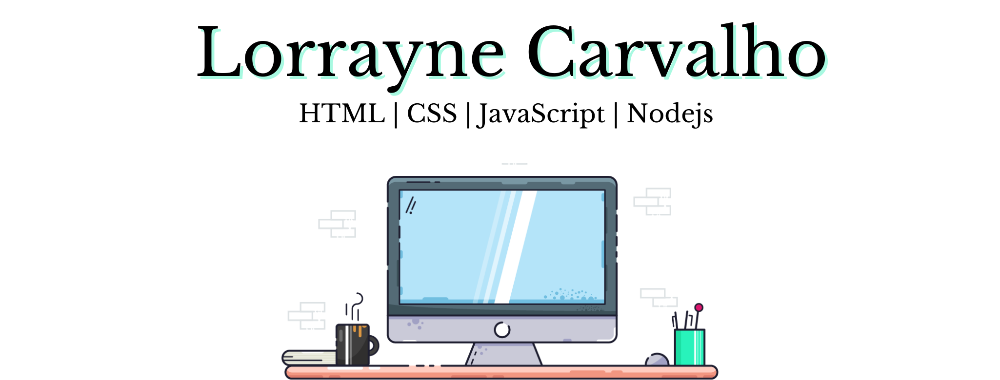

### console.log("Olá") 👋

------------------------------------------------------------------------------------------------------------------------------
         

* :mortar_board: Formada em Sistemas de Informação;
* :office: Possuo 4 anos de experiência com monitoria de qualidade no Atendimento ao Cliente. 
* :office: O sonho de trabalhar com desenvolvimento me fez buscar por uma transição de carreira e atualmente sou desenvolvedora :hearts: em uma empresa que possui uma plataforma com conteúdos voltados para um público em especifico.

* :cat: Mãe do Théo;
* :notes: Música, :dancer: Dança e :lotus_position_woman: Yoga; 
* Apaixonada por futebol e Rubro Negra :hearts: :black_heart:;
* **Estou em um processo de aprendizado constante.**

*Começar é o primeiro passo, não desistir é o segundo* :bulb:

###### SEJA BEM VINDO(A), :wave: :punch: 

<!--
**LorrayneCarvalho/LorrayneCarvalho** is a ✨ _special_ ✨ repository because its `README.md` (this file) appears on your GitHub profile.

Here are some ideas to get you started:

- 🔭 I’m currently working on ...
- 🌱 I’m currently learning ...
- 👯 I’m looking to collaborate on ...
- 🤔 I’m looking for help with ...
- 💬 Ask me about ...
- 📫 How to reach me: ...
- 😄 Pronouns: ...
- ⚡ Fun fact: ...
-->
